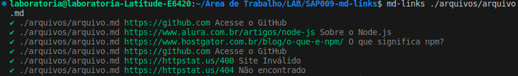
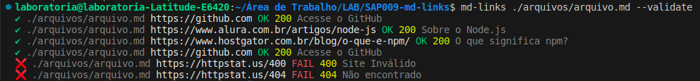
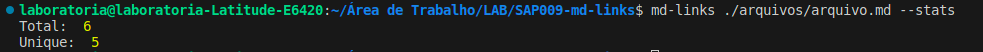
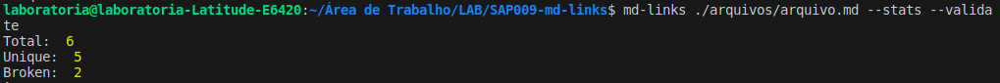
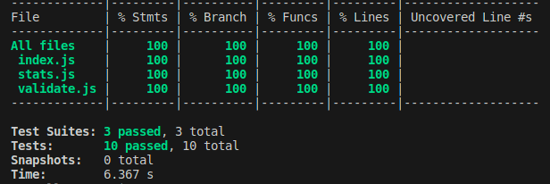

# Markdown Links

## 1. Resumo do projeto

Este projeto foi desenvolvido a partir da criação de uma ferramenta de linha de comando (CLI) assim como a sua própria biblioteca (library) em Javascript. Foram utilizadas as principais tecnologias do Node.js para desenvolvimento do código e o Jest para aplicação dos devidos testes.

O principal objetivo dessa biblioteca é realizar leituras de arquivos do tipo Markdown dentro da sua máquina, seus respectivos erros no caso de extensões ou leituras de arquivos não compatíveis e verificar a presença de links nestes arquivos. Também é possível verificar a validação desses links e identificar as suas devidas estatísticas. Esta biblioteca é um executável que pode ser chamado tanto por linha de comando, como também pode ser realizada a sua importação.
 
## 2. Objetivos de aprendizagem

* JavaScript
* Node.js
* HTTP

## 3. Instalação

* Este projeto pode ser instalado via comando:

### npm install md-links-brusilveira

## 4. Funcionalidades
As funcionalidades atualmente disponíveis são:

* Listagem de links: Exibe os links encontrados nos arquivos com extensão Markdown, mostrando a URL encontrada, o texto descritivo do link e a rota do arquivo.

* Validação de links: Verifica se os links encontrados nos arquivos Markdown estão funcionando corretamente, retornando o código de resposta HTTP, que mostra se o link é válido ou não, e uma mensagem de confirmação para comprovar se está tudo em ordem (OK), ou se houve alguma falha (FAIL).

* Estatísticas de links: Exibe o número total de links encontrados no arquivo, o total de links únicos e o total de links que não estão funcionando corretamente (quebrados).

## 5. Instruções de Uso e Comando

* Listagem de links

  Para localizar os links em um arquivo de interesse, utilize o comando abaixo:

  ### md-links ./caminho-do-arquivo/arquivo.md

  O comportamento padrão ao colocar apenas o caminho do arquivo é devolver apenas os links e suas devidas descrições:

  

* Validação de links
   
  Para validar os links em um arquivo de interesse, utilize o comando abaixo:

  ### md-links ./caminho-do-arquivo/arquivo.md --validate

  Ao passar a opção --validate, o módulo faz uma requisição HTTP e verifica se o link funciona ou não retornando seu devido status:

  

* Estatísticas de links
 - Total
 - Unique

  
  Para verificar a quantidade total de links e os links únicos em um arquivo de interesse, utilize o comando abaixo:

  ### md-links ./caminho-do-arquivo/arquivo.md --stats

  Ao passar a opção --stats o output será um texto com estatísticas básicas sobre os links, informando a quantidade de links no arquivo e quantos são únicos:

  

* Estatísticas de links
  - Total
  - Unique
  - Broken

  Já para verificar a quantidade total de links, os links únicos e os links quebrados (que não funcionam) em um arquivo de interesse, utilize o comando abaixo:

  ###  md-links ./caminho-do-arquivo/arquivo.md --stats --validate

  Ao passar a opção --stats e --validate o output será um texto com estatísticas básicas sobre os links, informando a quantidade de links no arquivo, quantos são únicos e quantos não são válidos (quebrados)

  

## 6. Testes

A execução dos testes foi feito através do Jest e todos foram aprovados com 100% de cobertura:

  

  

## Este projeto foi criado e desenvolvido por Bruna Silveira.

